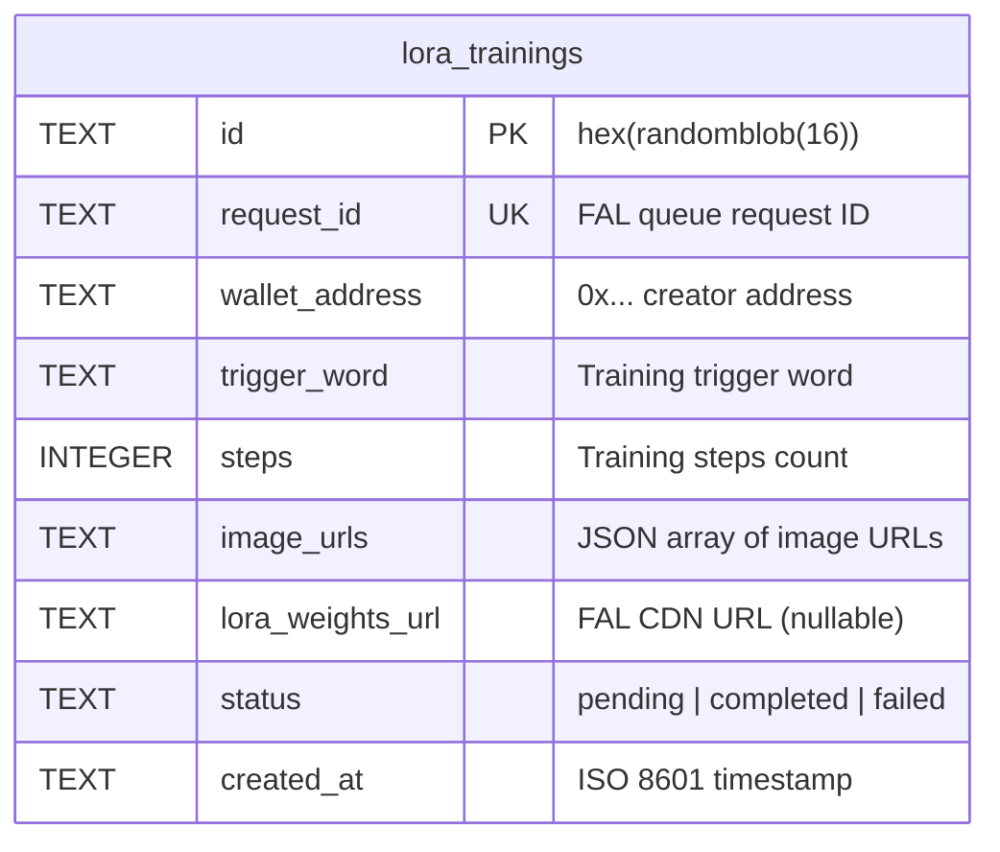

# feat: Add LoRA Gallery Page

## Overview

Add a public `/loras` page that displays all LoRA models trained through the app in a row-style layout with rich detail. Each row shows training image thumbnails, trigger word, LoRA weights URL (copy + download), wallet address attribution, date trained, training steps, and image count. Requires persisting training results to the Turso database (currently ephemeral — lost on page refresh).

## Problem Statement

When a LoRA training completes, the result URL is displayed once in the UI and lost on refresh. There is no record that a training ever happened. Users who pay $4 in ETH have no way to recover their LoRA weights URL if they close the tab or refresh the page.

## Proposed Solution

1. **Persist training metadata** to a new `lora_trainings` table in the existing Turso database
2. **Hybrid save approach**: Create a `pending` record at training submission time (server-side, inside `trainLora`), then update to `completed` with the weights URL when the client fetches the result
3. **New `/loras` page** with a public tRPC query showing all completed trainings in row layout

### Why hybrid save?

If the save is purely client-triggered, closing the tab before the save fires means a paid training is lost forever. By creating a `pending` record at submission time, we at minimum have the `requestId` and metadata recorded. The client updates it to `completed` when the result arrives.

## Technical Approach

### Architecture

```
┌─────────────────────────────────────────────────────┐
│ Client (ArenaChannelFetcher)                        │
│                                                     │
│  1. Submit training ──► fal.trainLora mutation       │
│     (server creates pending record in Turso)        │
│                                                     │
│  2. Poll status ──► fal.getTrainingStatus           │
│                                                     │
│  3. Fetch result ──► fal.getTrainingResult          │
│     Then call ──► lora.complete mutation             │
│     (server updates record to completed + URL)      │
│                                                     │
│  4. Visit /loras ──► lora.list query (public)       │
└─────────────────────────────────────────────────────┘

┌─────────────────────────────────────────────────────┐
│ Turso Database                                      │
│                                                     │
│  lora_trainings table                               │
│  ├── id (TEXT PK)                                   │
│  ├── request_id (TEXT UNIQUE)                       │
│  ├── wallet_address (TEXT NOT NULL)                 │
│  ├── trigger_word (TEXT NOT NULL)                   │
│  ├── steps (INTEGER NOT NULL)                       │
│  ├── image_urls (TEXT NOT NULL, JSON array)         │
│  ├── lora_weights_url (TEXT, nullable)              │
│  ├── status (TEXT: pending|completed|failed)        │
│  └── created_at (TEXT, ISO timestamp)               │
└─────────────────────────────────────────────────────┘
```

### ERD



### Implementation Phases

#### Phase 1: Database Layer

**Create standalone Kysely instance** — `packages/api/src/db.ts`

The existing Kysely instance is embedded inside better-auth and not exported. Create a shared `db` module that both the new `lora` router and potentially other features can use.

```typescript
// packages/api/src/db.ts
import { Kysely } from "kysely";
import { LibsqlDialect } from "@libsql/kysely-libsql";

interface Database {
  lora_trainings: LoraTrainingsTable;
}

interface LoraTrainingsTable {
  id: string;
  request_id: string;
  wallet_address: string;
  trigger_word: string;
  steps: number;
  image_urls: string; // JSON array
  lora_weights_url: string | null;
  status: "pending" | "completed" | "failed";
  created_at: string;
}

export function getDb() {
  return new Kysely<Database>({
    dialect: new LibsqlDialect({
      url: process.env.TURSO_DATABASE_URL!,
      authToken: process.env.TURSO_AUTH_TOKEN,
    }),
  });
}
```

**Auto-create table** on first use via `CREATE TABLE IF NOT EXISTS`:

```sql
CREATE TABLE IF NOT EXISTS lora_trainings (
  id TEXT PRIMARY KEY,
  request_id TEXT UNIQUE NOT NULL,
  wallet_address TEXT NOT NULL,
  trigger_word TEXT NOT NULL,
  steps INTEGER NOT NULL,
  image_urls TEXT NOT NULL,
  lora_weights_url TEXT,
  status TEXT NOT NULL DEFAULT 'pending',
  created_at TEXT NOT NULL
);
CREATE INDEX IF NOT EXISTS idx_lora_trainings_created_at ON lora_trainings(created_at);
CREATE INDEX IF NOT EXISTS idx_lora_trainings_status ON lora_trainings(status);
```

**Files to modify/create:**
- `packages/api/src/db.ts` — **CREATE** — standalone Kysely instance + table init
- `packages/api/package.json` — **MODIFY** — add `kysely` and `@libsql/kysely-libsql` dependencies

#### Phase 2: tRPC Router — `lora` Feature

**Create** `packages/api/src/features/lora.ts` with three procedures:

**`lora.create`** (called internally from `trainLora`, not directly from client)
- Creates a `pending` record with training metadata
- Input: `{ requestId, walletAddress, triggerWord, steps, imageUrls }`

**`lora.complete`** (`protectedProcedure` mutation)
- Updates a pending record to `completed` with the weights URL
- Input: `{ requestId, loraWeightsUrl }`
- Uses upsert semantics (`INSERT OR IGNORE` / `ON CONFLICT`) to prevent duplicates
- Validates that the caller's wallet matches the record's wallet

**`lora.list`** (`publicProcedure` query)
- Returns all `completed` LoRAs ordered by `created_at DESC`
- No auth required
- Returns: `{ id, requestId, walletAddress, triggerWord, steps, imageUrls (parsed), loraWeightsUrl, createdAt }`

**Files to modify/create:**
- `packages/api/src/features/lora.ts` — **CREATE** — loraRouter with create, complete, list
- `packages/api/src/index.ts` — **MODIFY** — add `lora: loraRouter` to appRouter
- `packages/api/src/features/fal.ts` — **MODIFY** — call `lora.create` inside `trainLora` after successful FAL submission (before returning requestId)

#### Phase 3: Client-Side Auto-Save Hook

**Modify** `ArenaChannelFetcher.tsx` to call `lora.complete` when training finishes.

Add a `useEffect` that fires when `trainingPhase === "completed"` and `trainingResult.data` is available. Use a `useRef` flag to prevent double-fires from React strict mode.

```typescript
const hasSaved = useRef(false);
const completeLora = trpc.lora.complete.useMutation();

useEffect(() => {
  if (trainingPhase === "completed" && trainingResult.data?.data && !hasSaved.current) {
    hasSaved.current = true;
    const loraUrl = getLoraWeightsUrl(trainingResult.data.data);
    if (loraUrl) {
      completeLora.mutate({
        requestId: trainingRequestId!,
        loraWeightsUrl: loraUrl,
      });
    }
  }
}, [trainingPhase, trainingResult.data]);
```

Reset `hasSaved.current = false` when a new training starts.

**Files to modify:**
- `apps/lora-trainer/src/components/ArenaChannelFetcher.tsx` — **MODIFY** — add save effect
- `apps/lora-trainer/src/components/TrainingProgress.tsx` — **MODIFY** — add "View in Gallery" link on completion

#### Phase 4: Gallery Page + Components

**Create** `apps/lora-trainer/src/pages/loras.tsx` — the gallery page.

**Create** `apps/lora-trainer/src/components/LoraGallery.tsx` — gallery component with row layout.

**Row layout** using Reshaped `View` components (following existing patterns from `SelectedImageList.tsx`):

```tsx
// Each row:
<View direction="row" align="center" gap={4} padding={4}
  borderRadius="medium" borderColor="neutral-faded">

  {/* Thumbnails (first 4 images) */}
  <View direction="row" gap={1}>
    {imageUrls.slice(0, 4).map((url, i) => (
      <Image key={i} src={url} width={48} height={48} displayMode="cover"
        borderRadius="small" />
    ))}
    {imageUrls.length > 4 && (
      <Text variant="caption-1" color="neutral-faded">+{imageUrls.length - 4}</Text>
    )}
  </View>

  {/* Details */}
  <View.Item grow>
    <Text variant="body-1" weight="bold">{triggerWord}</Text>
    <View direction="row" gap={2}>
      <Text variant="caption-1" color="neutral-faded">{steps} steps</Text>
      <Text variant="caption-1" color="neutral-faded">{imageUrls.length} images</Text>
      <Text variant="caption-1" color="neutral-faded">{formattedDate}</Text>
    </View>
  </View.Item>

  {/* Wallet */}
  <Link href={`https://basescan.org/address/${walletAddress}`}>
    <Text variant="caption-1" color="neutral-faded">
      {walletAddress.slice(0, 6)}...{walletAddress.slice(-4)}
    </Text>
  </Link>

  {/* Actions */}
  <View direction="row" gap={2}>
    <Button variant="ghost" size="small" onClick={copyUrl}>Copy URL</Button>
    <Button variant="ghost" size="small" onClick={download}>Download</Button>
  </View>
</View>
```

**States to handle:**
- **Loading**: `<Loader />` centered
- **Empty**: "No LoRAs trained yet" message with link back to training page
- **Error**: `<Alert color="critical">` with retry

**Files to create:**
- `apps/lora-trainer/src/pages/loras.tsx` — **CREATE** — page component
- `apps/lora-trainer/src/components/LoraGallery.tsx` — **CREATE** — gallery with row layout
- `apps/lora-trainer/src/components/LoraRow.tsx` — **CREATE** — single row component

#### Phase 5: Navigation

Add minimal navigation between `/` and `/loras`.

**Options (keep it simple):**
- Add a `View` header bar at the top of both pages with links
- Or add a link in the existing `WalletStatus` area

**Files to modify:**
- `apps/lora-trainer/src/pages/index.tsx` — **MODIFY** — add "Gallery" link
- `apps/lora-trainer/src/pages/loras.tsx` — **MODIFY** — add "Train" link back to home

## Acceptance Criteria

### Functional Requirements

- [ ] New `lora_trainings` table created in Turso on first use (`packages/api/src/db.ts`)
- [ ] Training metadata saved as `pending` when `trainLora` submits to FAL (`packages/api/src/features/fal.ts`)
- [ ] Record updated to `completed` with weights URL when client fetches result (`packages/api/src/features/lora.ts`)
- [ ] Duplicate saves prevented via `UNIQUE` constraint on `request_id`
- [ ] `/loras` page renders all completed LoRAs in row layout (`apps/lora-trainer/src/pages/loras.tsx`)
- [ ] Each row shows: thumbnails (up to 4), trigger word, wallet (truncated + Basescan link), date, steps, image count
- [ ] Copy URL button copies LoRA weights URL to clipboard
- [ ] Download button opens/downloads the weights file
- [ ] Gallery is fully public — no auth required to view
- [ ] Empty state shown when no LoRAs exist
- [ ] Loading and error states handled
- [ ] Navigation links between `/` and `/loras`
- [ ] "View in Gallery" link shown on training completion screen

### Non-Functional Requirements

- [ ] Gallery loads all records in a single query (pagination deferred)
- [ ] Thumbnails use reasonably sized image URLs (not full originals)
- [ ] No N+1 queries — single query returns all needed data

## Dependencies & Risks

**Dependencies:**
- Existing Turso database must be accessible with current env vars
- `kysely` and `@libsql/kysely-libsql` need to be added to `packages/api`

**Risks:**
- **FAL URL expiration**: FAL CDN URLs may expire over time. Monitor and consider mirroring weights to own storage in future.
- **Are.na image URLs**: Generally stable on CloudFront CDN, but could break if channels are deleted. Accept as-is for v1.
- **Tab-close during save**: Hybrid approach (pending record at submission) mitigates this — the `requestId` is preserved even if the client never calls `complete`.

## File Change Summary

| File | Action | Purpose |
|------|--------|---------|
| `packages/api/src/db.ts` | CREATE | Standalone Kysely instance + table init |
| `packages/api/src/features/lora.ts` | CREATE | `loraRouter` with create, complete, list |
| `packages/api/src/index.ts` | MODIFY | Register `lora: loraRouter` |
| `packages/api/src/features/fal.ts` | MODIFY | Save pending record in `trainLora` |
| `packages/api/package.json` | MODIFY | Add kysely + libsql dependencies |
| `apps/lora-trainer/src/pages/loras.tsx` | CREATE | Gallery page |
| `apps/lora-trainer/src/components/LoraGallery.tsx` | CREATE | Gallery component |
| `apps/lora-trainer/src/components/LoraRow.tsx` | CREATE | Row component |
| `apps/lora-trainer/src/components/ArenaChannelFetcher.tsx` | MODIFY | Auto-save on completion |
| `apps/lora-trainer/src/components/TrainingProgress.tsx` | MODIFY | "View in Gallery" link |
| `apps/lora-trainer/src/pages/index.tsx` | MODIFY | Navigation link to /loras |

## Open Questions Resolved

| Question | Decision |
|----------|----------|
| Wallet address display | Truncated (`0x1234...abcd`) with Basescan link |
| Thumbnails per row | First 4, with "+N" indicator for more |
| Sort order | Newest first (`created_at DESC`) |
| Pagination | Deferred — load all in v1 |
| LoRA with no weights URL | Save record, hide download actions, show indicator |

## References

- Brainstorm: `docs/brainstorms/2026-02-11-lora-gallery-brainstorm.md`
- Existing row pattern: `apps/lora-trainer/src/components/SelectedImageList.tsx:21-59`
- tRPC router pattern: `packages/api/src/features/fal.ts:232`
- Training flow: `apps/lora-trainer/src/components/ArenaChannelFetcher.tsx:114-123`
- Auth context: `apps/lora-trainer/src/pages/api/trpc/[trpc].ts:7-25`
- Reshaped components: imported from `"reshaped"` per CLAUDE.md
