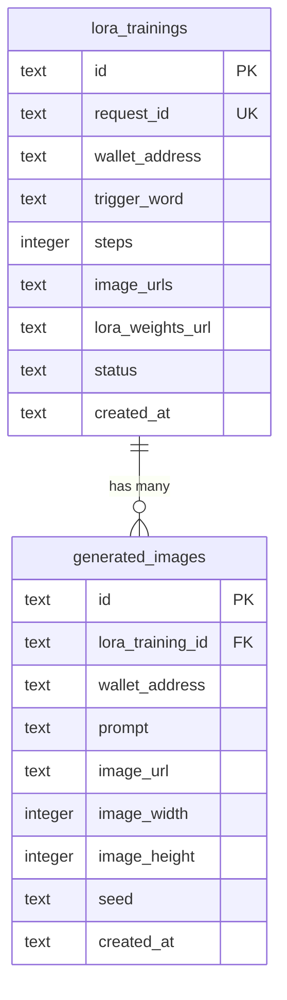

# feat: Add LoRA image generation and per-LoRA gallery

## Overview

Allow authenticated users to generate images from trained LoRA models via the `fal-ai/flux-lora` endpoint and browse all past generations on a per-LoRA detail page. The generation flow lives in a modal accessible from both the `/loras` gallery and post-training completion. Each generation produces 4 images with hardcoded settings, stores them in a `generated_images` table, and rate-limits users to 8 batches per 24 hours (admin exempt).

## Problem Statement / Motivation

Users can currently train LoRA models but have no way to generate images from them within the application. They must manually copy the weights URL to the fal.ai playground to test their models. This feature closes the loop — train, generate, and browse all in one place.

## Proposed Solution

### New Backend: `generateRouter` + `generated_images` table

- New `packages/api/src/features/generate.ts` with 3 tRPC procedures
- New `generated_images` table in Turso via the existing Kysely `ensureTable` pattern
- `fal.subscribe("fal-ai/flux-lora", {...})` for synchronous generation (~5-15s)
- Rate limiting via `COUNT(*)` query on `generated_images` (rolling 24h window)
- Admin/QA exemption reuses existing `isPaymentExempt()` from `payment.ts`

### New Frontend: `/loras/[id]` detail page + `GenerateModal`

- New dynamic route page with LoRA metadata + generated images gallery
- Generation modal follows the existing `PaymentGate` pattern (inline `<Modal>` with `active` prop)
- Prompt-only form; trigger word auto-appended invisibly; all other settings hardcoded

## Technical Approach

### Data Model



**Note:** `seed` is stored as `TEXT` (not INTEGER) because fal.ai seeds can exceed JavaScript's safe integer range.

**Table DDL:**

```sql
-- packages/api/src/db.ts
CREATE TABLE IF NOT EXISTS generated_images (
  id TEXT PRIMARY KEY,
  lora_training_id TEXT NOT NULL,
  wallet_address TEXT NOT NULL,
  prompt TEXT NOT NULL,
  image_url TEXT NOT NULL,
  image_width INTEGER,
  image_height INTEGER,
  seed TEXT,
  created_at TEXT NOT NULL
);
CREATE INDEX IF NOT EXISTS idx_gen_images_lora ON generated_images(lora_training_id);
CREATE INDEX IF NOT EXISTS idx_gen_images_wallet ON generated_images(wallet_address);
CREATE INDEX IF NOT EXISTS idx_gen_images_created ON generated_images(created_at);
```

### Implementation Phases

#### Phase 1: Backend — Database + tRPC procedures

**1a. Update `packages/api/src/db.ts`**

- Add `GeneratedImagesTable` interface
- Add to `Database` interface: `generated_images: GeneratedImagesTable`
- Add `ensureGeneratedImagesTable()` with separate `_genImagesInitialized` flag

```typescript
// packages/api/src/db.ts
export interface GeneratedImagesTable {
  id: string;
  lora_training_id: string;
  wallet_address: string;
  prompt: string;
  image_url: string;
  image_width: number | null;
  image_height: number | null;
  seed: string | null;
  created_at: string;
}
```

**1b. Add `lora.getById` procedure to `packages/api/src/features/lora.ts`**

- `publicProcedure` query, input: `z.object({ id: z.string() })`
- Returns single LoRA record (same shape as `lora.list` items) or throws `NOT_FOUND`
- Needed for the `/loras/[id]` page to load LoRA metadata

**1c. Update `createPendingLora` return value in `packages/api/src/features/lora.ts`**

- Currently returns `void` — change to return `{ id: string }` so the training flow can provide the LoRA database ID
- This enables the "Generate Images" button in `TrainingProgress` to link to `/loras/[id]`

**1d. Update `fal.trainLora` mutation in `packages/api/src/features/fal.ts`**

- Capture and return the LoRA `id` from `createPendingLora`
- Return shape changes from `{ requestId, zipUrl }` to `{ requestId, zipUrl, loraId }`

**1e. Create `packages/api/src/features/generate.ts`**

Three procedures:

| Procedure | Type | Input | Behavior |
|-----------|------|-------|----------|
| `generate.images` | `protectedProcedure` mutation | `{ loraTrainingId: string, prompt: string }` | Validate prompt (1-500 chars), check rate limit, look up LoRA for trigger word + weights URL, call fal.ai, save 4 images, return results |
| `generate.listByLora` | `publicProcedure` query | `{ loraTrainingId: string }` | Return all generated images for this LoRA, ordered by `created_at desc` |
| `generate.remaining` | `protectedProcedure` query | (none — uses `ctx.session.user`) | Return `{ remaining: number, limit: number, isExempt: boolean }` |

**`generate.images` mutation flow:**

```
1. Validate prompt length (1-500 chars)
2. Look up LoRA by loraTrainingId → get trigger_word, lora_weights_url
   - Throw NOT_FOUND if LoRA doesn't exist
   - Throw BAD_REQUEST if LoRA not completed or weights URL is null
3. Check rate limit (skip if isPaymentExempt)
   - COUNT(*) FROM generated_images WHERE wallet_address = X AND created_at > 24h ago
   - Group by batches: divide count by 4 → if >= 8 batches, throw FORBIDDEN
4. Build full prompt: `${prompt} in the style of ${trigger_word}`
5. ensureFalConfigured()
6. fal.subscribe("fal-ai/flux-lora", {
     input: {
       prompt: fullPrompt,
       loras: [{ path: loraWeightsUrl, scale: 1.5 }],
       image_size: "square_hd",
       num_inference_steps: 28,
       guidance_scale: 3.5,
       num_images: 4,
       enable_safety_checker: true,
       output_format: "jpeg"
     }
   })
7. For each image in result.images:
   - Insert into generated_images with generateId(), wallet_address from ctx, raw prompt (not fullPrompt)
8. Return array of { id, imageUrl, width, height, seed }
```

**Rate limit edge cases:**
- Rate limit checked BEFORE calling fal.ai (fail fast)
- Count based on actual stored images (not attempts), so failed generations don't consume slots
- Safety-filtered images: store however many fal.ai returns. Count as 1 batch regardless.

**1f. Register in `packages/api/src/index.ts`**

```typescript
import { generateRouter } from "./features/generate";
// ...
export const appRouter = router({
  fal: falRouter,
  arena: arenaRouter,
  payment: paymentRouter,
  lora: loraRouter,
  generate: generateRouter,
});
```

---

#### Phase 2: Frontend — Detail page + generation modal

**2a. Create `apps/lora-trainer/src/pages/loras/[id].tsx`**

- Uses `useRouter()` to get `id` from query params
- Calls `trpc.lora.getById.useQuery({ id })` for LoRA metadata
- Calls `trpc.generate.listByLora.useQuery({ loraTrainingId: id })` for gallery
- Layout: LoRA metadata at top → "Generate" button → image gallery grid below
- States: loading (Loader), error/not found (Alert + link to /loras), empty gallery (encouraging message)
- 404 case: "LoRA not found" Alert with link back to `/loras`
- Empty gallery: "No images generated yet. Click Generate to create your first images."

**2b. Create `apps/lora-trainer/src/components/GenerateModal.tsx`**

Props: `{ active, onClose, loraId, triggerWord, loraWeightsUrl }`

Following the PaymentGate modal pattern:

```tsx
<Modal active={active} onClose={onClose} position="center" padding={6}>
  <View gap={4} direction="column">
    <Text variant="title-3">Generate Images</Text>
    <Text variant="body-2" color="neutral-faded">
      Your prompt will include: "... in the style of {triggerWord}"
    </Text>
    <TextField
      value={prompt}
      onChange={({ value }) => setPrompt(value)}
      placeholder="Describe the image you want to create..."
      maxLength={500}
    />
    <Text variant="caption-1" color="neutral-faded">
      {remaining} of 8 generations remaining today
    </Text>
    <Button
      color="primary"
      onClick={handleGenerate}
      disabled={!prompt.trim() || isGenerating}
      loading={isGenerating}
    >
      Generate 4 Images
    </Button>
    {/* Results: 2x2 grid of generated images */}
    {/* Error states: rate limit hit, fal.ai error, expired weights */}
    {/* "Generate Again" button after results */}
  </View>
</Modal>
```

**Key behaviors:**
- `trpc.generate.remaining.useQuery()` to show rate limit count
- `trpc.generate.images.useMutation()` for generation
- On success: show 2x2 grid of images, "Generate Again" button
- On "Generate Again": clear previous results, keep prompt for editing
- On success: invalidate `generate.listByLora` query cache so gallery refreshes on modal close
- Error handling: show `Alert` for rate limit, fal.ai errors, expired weights URL
- Images clickable → open in new tab for full resolution

**2c. Create `apps/lora-trainer/src/components/GeneratedImageGrid.tsx`**

Reusable grid component for both the modal results and the detail page gallery.

```tsx
<View direction="row" wrap gap={2}>
  {images.map((img) => (
    <View.Item key={img.id} columns={{ s: 6, m: 6, l: 3 }}>
      <Actionable href={img.imageUrl} attributes={{ target: "_blank" }}>
        <Card>
          <Image src={img.imageUrl} alt={img.prompt} borderRadius="medium" />
          <View padding={2}>
            <Text variant="caption-1" maxLines={2}>{img.prompt}</Text>
            <Text variant="caption-1" color="neutral-faded">{formatDate(img.createdAt)}</Text>
          </View>
        </Card>
      </Actionable>
    </View.Item>
  ))}
</View>
```

In modal context: `columns={{ s: 6, m: 6 }}` (always 2x2).
In page context: `columns={{ s: 6, m: 6, l: 3 }}` (2 on mobile, 4 on desktop).

---

#### Phase 3: Integration — Wire up entry points

**3a. Update `apps/lora-trainer/src/components/LoraRow.tsx`**

- Add `id` prop to `LoraRowProps`
- Add "Generate" button or make the row clickable → navigates to `/loras/[id]`
- Keep existing "Copy URL" and "Download" actions

**3b. Update `apps/lora-trainer/src/components/LoraGallery.tsx`**

- Pass `id={lora.id}` to `<LoraRow>`

**3c. Update `apps/lora-trainer/src/components/TrainingProgress.tsx`**

- Accept a `loraId` prop (passed from parent after `trainLora` mutation returns `loraId`)
- Add "Generate Images" button alongside existing "View in Gallery" → links to `/loras/[loraId]`

**3d. Update `apps/lora-trainer/src/components/ArenaChannelFetcher.tsx`**

- Capture `loraId` from the `trainLora` mutation response
- Pass it to `<TrainingProgress loraId={loraId}>`

**3e. Update `apps/lora-trainer/src/pages/_app.tsx` navigation**

- Change `router.pathname === "/loras"` to `router.pathname.startsWith("/loras")` for the nav toggle
- When on `/loras/[id]`, the button should still say "Train" and link to `/`

**3f. Add fal.ai image domain to `next.config.js`** (if using `next/image`)

- Add `fal.media` and any other fal.ai CDN domains to `images.remotePatterns`
- Or use standard `` tags via Reshaped `Image` component

## Acceptance Criteria

### Functional Requirements

- [ ] Authenticated users can generate 4 images from a completed LoRA via a modal
- [ ] Prompt text field accepts 1-500 characters; trigger word auto-appended
- [ ] Generation uses hardcoded settings: Square HD, 28 steps, 3.5 guidance, 1.5 LoRA scale, jpeg
- [ ] Generated images are persisted to `generated_images` table with id, prompt, image_url, wallet_address, seed, timestamps
- [ ] Rate limit: 8 batches per 24h rolling window per wallet address
- [ ] Admin/QA wallets are exempt from rate limiting (reuses `isPaymentExempt`)
- [ ] `/loras/[id]` detail page shows LoRA metadata + full gallery of generated images
- [ ] Gallery shows all images for the LoRA (all users), ordered newest first
- [ ] "Generate" button accessible from LoRA rows in `/loras` gallery
- [ ] "Generate Images" button accessible from training completion state
- [ ] Generated images are clickable (open full-size in new tab)
- [ ] Modal shows remaining generation count
- [ ] "Generate Again" replaces previous results in modal, retains prompt for editing
- [ ] Gallery auto-refreshes when modal closes after successful generation

### Error States

- [ ] Not found: `/loras/[id]` with invalid ID shows "LoRA not found" with link to gallery
- [ ] Not completed: attempting to generate from a pending/failed LoRA shows appropriate error
- [ ] Rate limited: show remaining time and limit info
- [ ] fal.ai error: show error Alert in modal with retry option
- [ ] Safety filtered: if fewer than 4 images returned, display what was returned with explanation
- [ ] Unauthenticated: AuthGuard wraps generation, prompts sign-in

## Dependencies & Risks

### Dependencies
- `@fal-ai/client` — already installed, same API key works for `fal-ai/flux-lora`
- Turso — already configured, same database
- No new environment variables needed

### Risks
- **fal.ai URL expiration**: Generated image URLs may expire over time. Acceptable for v1; noted as future optimization (copy to own storage).
- **Request timeout**: `fal.subscribe()` blocks for 5-15s. If deployed on Vercel Hobby (10s timeout), some requests may fail. Verify deployment tier supports ≥30s timeout, or fall back to queue+poll pattern.
- **Rate limit bypass**: Users can connect multiple wallets. Acceptable for v1 — rate limit primarily controls costs, and wallet switching requires SIWE re-auth each time.

## Files to Create/Modify

| File | Action | Purpose |
|------|--------|---------|
| `packages/api/src/db.ts` | Modify | Add `GeneratedImagesTable` + `ensureGeneratedImagesTable()` |
| `packages/api/src/features/generate.ts` | **Create** | New `generateRouter` with 3 procedures |
| `packages/api/src/features/lora.ts` | Modify | Add `getById` query, update `createPendingLora` return |
| `packages/api/src/features/fal.ts` | Modify | Return `loraId` from `trainLora` mutation |
| `packages/api/src/index.ts` | Modify | Register `generateRouter` |
| `apps/lora-trainer/src/pages/loras/[id].tsx` | **Create** | LoRA detail page |
| `apps/lora-trainer/src/components/GenerateModal.tsx` | **Create** | Generation modal |
| `apps/lora-trainer/src/components/GeneratedImageGrid.tsx` | **Create** | Reusable image grid |
| `apps/lora-trainer/src/components/LoraRow.tsx` | Modify | Add `id` prop + navigation |
| `apps/lora-trainer/src/components/LoraGallery.tsx` | Modify | Pass `id` to LoraRow |
| `apps/lora-trainer/src/components/TrainingProgress.tsx` | Modify | Add "Generate Images" button |
| `apps/lora-trainer/src/components/ArenaChannelFetcher.tsx` | Modify | Capture + pass `loraId` |
| `apps/lora-trainer/src/pages/_app.tsx` | Modify | Fix nav toggle for `/loras/*` paths |

## Future Optimizations (out of scope for v1)

- Pagination / infinite scroll on gallery
- Configurable generation settings (advanced accordion)
- Image download (individual + batch zip)
- Prompt history / autocomplete
- Copy images to own S3/R2 storage (fal.ai URL durability)
- Batch grouping UX (group 4 images from same generation)
- Favoriting / tagging images
- Share links for individual images
- Payment gating per generation

## References

- Brainstorm: `docs/brainstorms/2026-02-11-lora-image-generation-brainstorm.md`
- Existing fal.ai integration: `packages/api/src/features/fal.ts`
- Modal pattern: `apps/lora-trainer/src/components/PaymentGate.tsx`
- DB pattern: `packages/api/src/db.ts`
- LoRA router: `packages/api/src/features/lora.ts`
- Auth guard: `apps/lora-trainer/src/components/AuthGuard.tsx`
- fal.ai flux-lora docs: https://fal.ai/models/fal-ai/flux-lora
